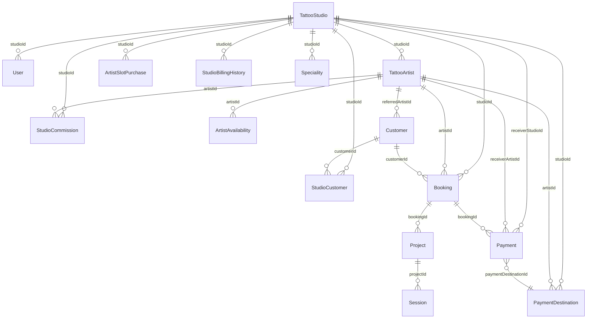
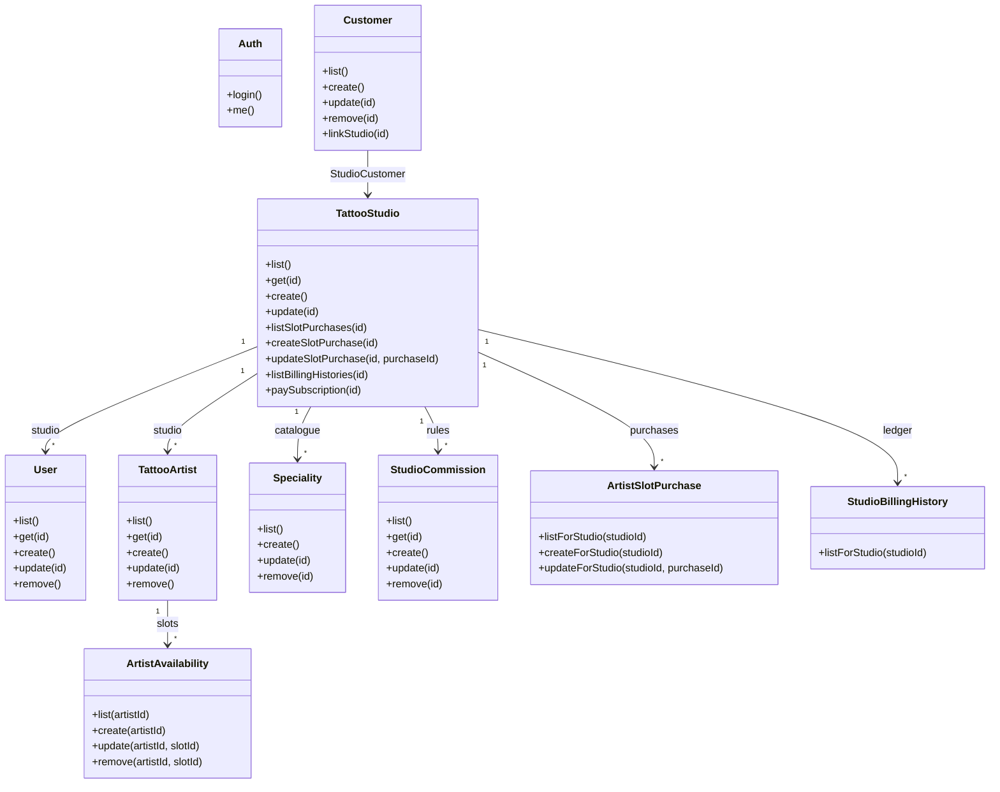
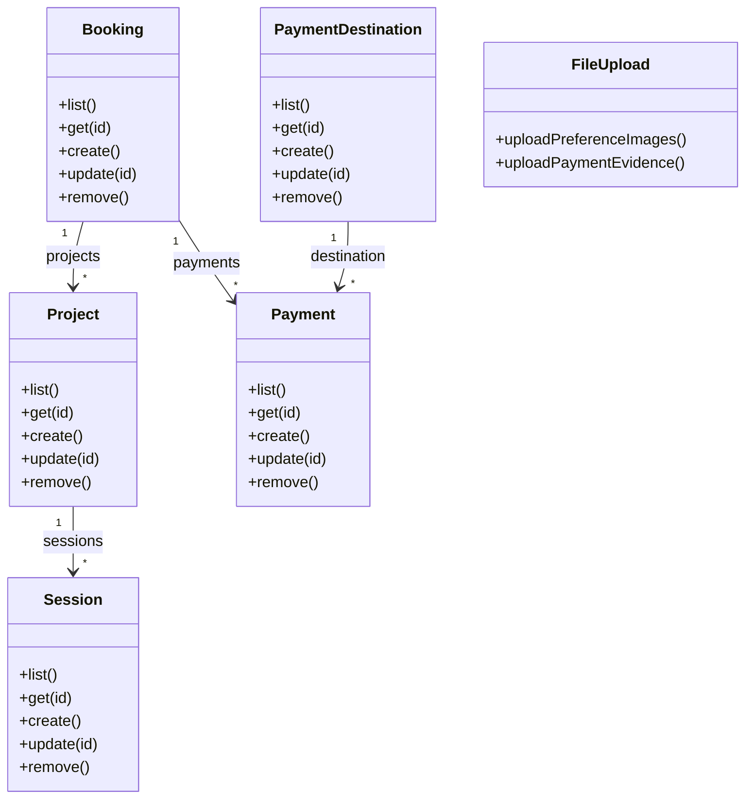

# Post.Ink — documentation

Reference for **who uses the system** and **how data is stored** in the database (Prisma / SQLite). For **product intent and problems solved**, see **Product overview (PRD)**; for **libraries and tooling**, see **Tech stack**.

---

## Product overview (PRD)

### Product description

**Post.Ink** is a web application for **tattoo studios** and **artists** to run day-to-day operations in one place: public discovery and booking, internal scheduling and money tracking, and **multi-studio** support for a platform operator. Studios work in **Management** (`/manage`); visitors book and browse **without** a login account.

### Problems this project solves

| Problem / gap | What we built |
|---------------|----------------|
| **Fragmented studio operations** | Single app for artists, availability, bookings, projects, sessions, customers/leads, commissions, payment destinations, and studio-scoped users—with **JWT auth** and **role-based** access (`super_admin`, `admin`, `staff`). |
| **No clear public booking path** | **Discover** and **artist profile** flows plus a **book** form (`/artists/:id/book`) with preference images, lead capture, and studio/artist context—no customer account required. |
| **Hard to track money across studio vs artist** | **Payments** tied to bookings, **payment destinations** (studio or artist), receivable-style helpers, and UI to record and reconcile flows. |
| **Subscription and seat limits ad hoc** | **Studio subscription** model: licensed **artist seats**, **monthly/annual** pricing, **grace period** after due date, **add-on artist slots** with **prorated** charges to next billing, **pending → paid/expired** slot purchases, and **billing history**—enforced when adding artists (`assertCanAddArtist`). |
| **Leads vs customers unclear** | **`Customer`** records with **`lead` / `customer`**, **lead sources** (e.g. website, walk-in, artist referral), and links to studios via **`StudioCustomer`**. |
| **Multi-tenant isolation** | Studio data scoped by **`studioId`**; **super admin** can operate across studios (create studios, pick studio in UI) while normal users only see their tenant. |
| **Documentation scattered** | This **`DOCUMENTATION.md`** (roles, schema, constants, ERD/UML) is rendered on **`/docs`** for a single source of truth. |

### Out of scope (for later or external tools)

Exact **payment gateway** capture (cards), **email/SMS** notifications, **native mobile apps**, and **full analytics** are not required for the core PRD above; the product focuses on **data model**, **workflows**, and **subscription/seat** rules you can extend.

---

## Tech stack

Summary of technologies in this repository. **Versions** match `package.json` at the time of writing; run `npm list` or open those files after upgrades for the current semver range.

### Overview

| Layer | Technology | Role in Post.Ink |
|-------|------------|------------------|
| **Frontend** | **React 18**, **Vite 5**, **React Router 6** | SPA UI: public pages, Management, `/docs` (Markdown + **Mermaid** diagrams). |
| **Backend** | **Node.js** (ES modules), **Express 4** | REST API under `/api`, static uploads, JWT middleware. |
| **Data** | **Prisma 5**, **SQLite** | Schema, migrations, queries; `DATABASE_URL` file DB in dev (`backend/prisma`). |
| **Auth** | **jsonwebtoken**, **bcryptjs** | JWT sessions for Management users; password hashing. |
| **Uploads** | **Multer** | Multipart uploads (e.g. preference images, payment evidence) with size/count limits. |
| **Cross-origin** | **cors** | API accepts browser requests from the Vite dev origin (and configured prod origins). |
| **Config** | **dotenv** | Backend env (`DATABASE_URL`, `PORT`, `JWT_SECRET`). Frontend: **`VITE_API_URL`** (optional) in `frontend/src/api.js`. |
| **Monorepo scripts** | **concurrently**, **wait-on** | Root `npm run dev` starts backend + frontend and optional browser open. |

### Frontend (`frontend/`)

- **react** / **react-dom** ^18.2 — UI components and state.
- **react-router-dom** ^6.28 — Routes (e.g. `/`, `/manage`, `/docs`, `/artists/:id/book`).
- **mermaid** ^11.x — Renders ERD / UML code fences on the Docs page (`DocsMermaid.jsx`).
- **vite** ^5.4 + **@vitejs/plugin-react** — Dev server, HMR, production build; proxies **`/api`** and **`/uploads`** to the backend in development.

### Backend (`backend/`)

- **express** — HTTP routing (`backend/src/routes/*.js`), JSON body, `requireAuth` on management API.
- **@prisma/client** / **prisma** ^5.22 — ORM and CLI (`migrate`, `generate`, `studio`, `seed`).
- **jsonwebtoken** — Issue and verify JWTs after login.
- **bcryptjs** — Hash and compare passwords for **`User`**.
- **multer** — Disk uploads under `backend/uploads` (or as configured).
- **cors**, **dotenv** — CORS policy and environment loading.

### Runtime requirements

- **Node.js 18+** recommended (matches typical Vite 5 / modern ESM usage).

---

## User types

### Platform users (management login)

These are rows in the **`User`** table. They sign in to **Management** (`/manage`) and call the API with a JWT.

| Role | Description | Studio link | Typical capabilities |
|------|-------------|-------------|----------------------|
| **super_admin** | Platform operator | `studioId` usually null | Sees all studios; header studio picker; can create studios; full cross-tenant visibility where the API allows. |
| **admin** | Studio administrator | Required (`studioId`) | Manages one studio: bookings, artists, customers, payments, subscription, confirming slot payments, users for that studio. |
| **staff** | Studio staff | Required (`studioId`) | Same studio scope as admin for most day-to-day data; some actions (e.g. confirming certain payments) may be **admin-only** per route. |

Staff and admin users only see data for **their** `studioId`. Super admin selects a studio in the UI (or is guided to) so scoped queries include `?studioId=…` where applicable.

### Customer & lead records (not login accounts)

Stored in **`Customer`**. Used for bookings and CRM-style lists; they do **not** log into Management.

| `type` value | Meaning |
|--------------|---------|
| **customer** | Active customer of a studio (default). |
| **lead** | Prospect; may have `leadSource`, optional `referredArtistId` to a **`TattooArtist`**. |

Links to studios are via **`StudioCustomer`** (many-to-many: one customer can belong to multiple studios).

### Public (no login)

Visitors use **Discover**, artist profiles, and **book** flows (`/`, `/artists/:id`, `/artists/:id/book`) without a `User` account.

---

## Constants, env vars & business rules

Fixed values used across the app, in **table** form. Use this when changing pricing, limits, or scaling behaviour: check **Source** so frontend and backend stay aligned.

### Environment variables

| Variable | Description | Typical value | Required | Source |
|----------|-------------|---------------|----------|--------|
| `DATABASE_URL` | Prisma SQLite connection string | `file:./dev.db` | Yes for DB | `backend/.env`, `backend/prisma/schema.prisma` |
| `PORT` | HTTP port for the API | `3001` | No (default `3001`) | `backend/src/index.js` |
| `JWT_SECRET` | Secret for signing JWT access tokens | Strong random string in production | **Yes in production** | `backend/src/middleware/auth.js` (see `backend/.env.example`) |
| `VITE_API_URL` | Browser base URL for API (no trailing slash) | Empty string = same origin + `/api` | No | `frontend/src/api.js` (Vite env at build time) |

### Money, subscription & proration (scaling-critical)

These drive **expected subscription amounts**, **add-on artist slot** quotes, and **capacity**. The **same IDR price** and **same proration divisor** are defined in **two places** today; if you change pricing, update **both** or extract shared config.

| Name | Value | Description | Formula / logic | Source |
|------|-------|-------------|-----------------|--------|
| `SUBSCRIPTION_IDR_PER_ARTIST_MONTHLY` | `250000` (IDR) | Monthly list price **per licensed artist seat** (subscription) | **Monthly** recurring = `n × 250000`. **Annual** recurring = `n × 250000 × 12 × SUBSCRIPTION_ANNUAL_DISCOUNT`. UI also **infers** seat count from `subscriptionAmount` when `subscriptionUserCount` is missing: `round(amount / (250000×12×0.8))` annual or `round(amount / 250000)` monthly. | `frontend/src/pages/Studio.jsx` |
| `PRICE_PER_ARTIST_SLOT_IDR` | `250000` (IDR) | Per-seat monthly rate used for **add-on slot** purchases (should match subscription per-artist rate) | **Daily rate** = `PRICE_PER_ARTIST_SLOT_IDR / PRORATE_DIVISOR_DAYS`. **Prorated add-on** = `dailyRate × min(remainingDaysUntilNextBilling, PRORATE_DIVISOR_DAYS) × slotCount`. Caps “chargeable days” at divisor so a long cycle does not over-charge. | `backend/src/utils/artist-slots.js` |
| `SUBSCRIPTION_ANNUAL_DISCOUNT` | `0.8` | Annual billing multiplier (= **20% discount** vs 12× monthly) | Annual total = `monthly_component × 12 × 0.8` where `monthly_component = 250000 × n` seats. | `frontend/src/pages/Studio.jsx` |
| `SLOT_PRORATE_DIVISOR_DAYS` (frontend) | `25` | Denominator for “daily” rate in **subscription UI** quotes | `dailyRate = 250000 / 25`; same cap pattern as backend: `chargeableDays = min(remainingDays, 25)`. | `frontend/src/pages/Studio.jsx` |
| `PRORATE_DIVISOR_DAYS` (backend) | `25` | Same meaning for **server-side** slot purchase amount | `computeSlotPurchaseAmount`: `effectiveDays = min(remainingDays, 25)`; `dailyRate = PRICE_PER_ARTIST_SLOT_IDR / 25`. | `backend/src/utils/artist-slots.js` |
| `SUBSCRIPTION_GRACE_DAYS` | `5` | After next billing date, studio is treated as **past grace** in subscription UI when `daysLeft < -5` | Compare calendar days to `subscriptionNextBillingDate`; UI messaging for paid / in-grace / overdue. | `frontend/src/pages/Studio.jsx` |
| `PENDING_EXPIRY_DAYS` | `7` | `pending_payment` **artist slot** purchase rows expire after this many days | `expiresAt = now + 7 days` when creating pending purchase; background expiry via `expireStaleArtistSlotPurchases`. | `backend/src/utils/artist-slots.js` (not exported) |

**Artist capacity (formula):** `maxArtists = subscriptionUserCount + sum(slots)` over **`ArtistSlotPurchase`** with status **`paid`**. Pending payment blocks adding artists until paid or expired. Implemented in `getArtistCapacity` / `assertCanAddArtist` in `backend/src/utils/artist-slots.js`.

### Upload & file limits

| Name | Value | Description | Notes | Source |
|------|-------|-------------|-------|--------|
| `MAX_IMAGE_SIZE` | `2097152` (2 MiB) | Max bytes per image on public booking preference upload | Client-side check before upload | `frontend/src/pages/BookingForm.jsx` |
| `MAX_PREFERENCE_IMAGES` | `3` | Max preference images per booking | Client-side | `frontend/src/pages/BookingForm.jsx` |
| `MAX_SIZE` | `2097152` (2 MiB) | Multer limit per file | Server-side enforcement | `backend/src/routes/uploads.js` |
| `MAX_FILES` | `3` | Multer max files for `/api/uploads/preference` | Matches frontend cap | `backend/src/routes/uploads.js` |
| Payment evidence | `1` file, 2 MiB | `/api/uploads/payment-evidence` | Single file | `backend/src/routes/uploads.js` |

### UI, pagination & calendar

| Name | Value | Description | Source |
|------|-------|-------------|--------|
| `ROWS_PER_PAGE` | `8` | Table page size (studio artists list, etc.) | `frontend/src/pages/Studio.jsx`, `frontend/src/pages/ArtistList.jsx` |
| `SLOT_HOURS_START` | `9` | Start hour for availability slot grid | `frontend/src/pages/ArtistAvailability.jsx` |
| `SLOT_HOURS_END` | `21` | End hour (exclusive-style day range for slots) | `frontend/src/pages/ArtistAvailability.jsx` |
| `STORAGE_KEY` | `postink_auth` | localStorage JSON session payload | `frontend/src/context/AuthContext.jsx` |
| `AUTH_TOKEN_KEY` | `postink_auth_token` | localStorage JWT string for `fetch` | `frontend/src/api.js` |
| Created-toast timeout | `5000` ms | Toast visibility after `?created=1` | `frontend/src/pages/Studio.jsx` |

### IDs, codes & generation

| Name | Value | Description | Source |
|------|-------|-------------|--------|
| Numeric ID length | `6` digits | `generateNumericId` default for **Customer**, **Project**, **Session** | `backend/src/utils/id.js` |
| ID collision retries | `20` | Max attempts before throwing | `backend/src/utils/id.js` |
| Booking `shortCode` length | `5` characters | Alphanumeric public code (36-char alphabet) | `backend/src/routes/bookings.js` |
| `SHORT_CODE_CHARS` | `0-9`, `A-Z` | 36 symbols; index `byte % 36` | `bookings.js`, `backend/prisma/seed.js` |
| Short code uniqueness retries | `20` | Regenerate on collision | `backend/src/routes/bookings.js` |

### Display-only conversion

| Name | Value | Description | Source |
|------|-------|-------------|--------|
| `IDR_TO_USD` | `0.000063` | **Approximate** IDR→USD for secondary display only | `frontend/src/currency.js` |

Not used for billing or persistence; update if you need fresher FX for UI.

### Domain enums & allowed values (API / UI)

Strings enforced or assumed in routes/UI. Changing these requires **migrations** only if stored values need to stay compatible with old rows.

| Domain | Variable / set | Allowed values | Source |
|--------|----------------|----------------|--------|
| User roles | `ROLES` | `super_admin`, `admin`, `staff` | `backend/src/middleware/auth.js`; Prisma `User.role` default `staff` |
| Subscription cycle | `SUBSCRIPTION_CYCLES` | `monthly`, `annual` | `backend/src/routes/studios.js` |
| Subscription payment status | `SUBSCRIPTION_PAYMENT_STATUSES` | `unpaid`, `paid`, `overdue` | `backend/src/routes/studios.js` |
| Artist slot purchase status | `SLOT_PURCHASE_STATUS` | `pending_payment`, `paid`, `expired` | `backend/src/utils/artist-slots.js` |
| Customer type | `CUSTOMER_TYPES` | `lead`, `customer` | `backend/src/routes/customers.js` |
| Lead source | `LEAD_SOURCES` | `website`, `instagram`, `tiktok`, `walkin`, `whatsapp`, `artist` | `backend/src/routes/customers.js` |
| Session status | `SESSION_STATUSES` | `scheduled`, `in_progress`, `paused`, `completed` | `backend/src/routes/sessions.js` |
| Payment destination type | `TYPES` | `Bank`, `Credit Card`, `Cash` | `backend/src/routes/payment-destinations.js` |
| Payment destination owner | `OWNER_TYPES` | `studio`, `artist` | `backend/src/routes/payment-destinations.js` |
| Payment receiver (finance util) | `RECEIVER_TYPES` | `studio`, `artist` | `backend/src/utils/booking-finance.js` |
| Booking finance receiver | (same idea) | Studio vs artist on `Payment` rows | `booking-finance.js` + payments routes |
| Studio UI booking status filter | `BOOKING_STATUSES` | `Unpaid`, `Paid` | `frontend/src/pages/Studio.jsx` (display filter, not necessarily all DB values) |

### Seed-only / dev constants

Used when running `prisma db seed`; safe to ignore for production runtime unless you rely on demo data shape.

| Name | Value | Description | Source |
|------|-------|-------------|--------|
| `EXTRA_UNPAID_NO_PROJECT` | `15` | Count of extra synthetic bookings in seed | `backend/prisma/seed.js` |

---

## Visual ERD

High-level **entity–relationship** view of the main Prisma models. For every column and type, see **Database structure** below. Diagram is rendered on the Docs page from Mermaid; in plain Markdown viewers you may see only a code block.

---

## Visual UML (operations per entity)

UML-style **class diagrams** list the main **management API operations** exposed for each domain entity (see `backend/src/routes` and `backend/src/index.js`). They are not methods on Prisma model classes in code; they are the **HTTP surface** grouped by entity for readability. `removeX` means `DELETE /api/.../x`.

### Tenants, people, and catalogue

### Bookings, projects, sessions, payments

---

## Database structure

SQLite database; schema defined in **`backend/prisma/schema.prisma`**. Table names below match Prisma **models** (actual SQL names may differ slightly in migrations).

### User

| Column | Type | Notes |
|--------|------|--------|
| id | String (cuid) | Primary key |
| email | String | Unique |
| passwordHash | String | Hashed password |
| name | String? | Optional display name |
| role | String | `super_admin` \| `admin` \| `staff` (default `staff`) |
| studioId | String? | FK → TattooStudio; null for super_admin |
| createdAt, updatedAt | DateTime | Auto |

### TattooStudio

| Column | Type | Notes |
|--------|------|--------|
| id | String (cuid) | PK |
| name, address, photo, location, logo, mapsUrl | String? | Profile / branding |
| subscriptionPlan | String? | e.g. `studio` |
| subscriptionCycle | String? | `monthly` \| `annual` |
| subscriptionUserCount | Int? | Licensed artist seats |
| subscriptionAmount | Float? | Computed billing amount |
| subscriptionPaymentStatus | String? | `unpaid` \| `paid` \| `overdue` |
| subscriptionNextBillingDate | String? | `YYYY-MM-DD` |
| createdAt, updatedAt | DateTime | Auto |

### TattooArtist

| Column | Type | Notes |
|--------|------|--------|
| id | String (cuid) | PK |
| studioId | String? | FK → TattooStudio |
| name | String | Required |
| shortDescription, experiences, speciality | String? | Profile text |
| rate | Float? | Hourly rate (IDR) |
| photos, portfolio | String | JSON arrays of URLs (stored as text) |
| isActive | Boolean | Default true |
| createdAt, updatedAt | DateTime | Auto |

### ArtistAvailability

| Column | Type | Notes |
|--------|------|--------|
| id | String (cuid) | PK |
| artistId | String | FK → TattooArtist |
| date | String | `YYYY-MM-DD` |
| startTime, endTime | String | e.g. `09:00` |
| isAvailable | Boolean | Default true |
| Unique | — | `(artistId, date, startTime)` |

### Customer

| Column | Type | Notes |
|--------|------|--------|
| id | String | PK (6-digit numeric in app) |
| name | String | |
| email, phone | String? | |
| type | String | `customer` \| `lead` (default `customer`) |
| leadSource | String? | |
| referredArtistId | String? | FK → TattooArtist (optional) |
| createdAt, updatedAt | DateTime | Auto |

### StudioCustomer

| Column | Type | Notes |
|--------|------|--------|
| id | String (cuid) | PK |
| studioId | String | FK → TattooStudio |
| customerId | String | FK → Customer |
| Unique | — | `(studioId, customerId)` |

### Booking

| Column | Type | Notes |
|--------|------|--------|
| id | String (cuid) | PK |
| shortCode | String? | Unique display code |
| artistId | String | FK → TattooArtist |
| customerId | String? | FK → Customer |
| studioId | String? | FK → TattooStudio |
| date | String | `YYYY-MM-DD` |
| startTime, endTime | String | |
| status | String | Default `Unpaid`; `Paid` when payment recorded |
| pricingType | String? | `fixed` \| `hourly` |
| totalAmount | Float? | Fixed total or derived for hourly |
| placement, preference, projectName, notes | String? | |
| createdAt, updatedAt | DateTime | Auto |

### Project

| Column | Type | Notes |
|--------|------|--------|
| id | String | PK (6-digit in app) |
| bookingId | String | FK → Booking |
| name | String | |
| pricingType | String | `fixed` \| `hourly` |
| fixedAmount, hourlyRate, agreedHours | Float? | Per pricing model |
| notes | String? | |
| createdAt, updatedAt | DateTime | Auto |

### Session

| Column | Type | Notes |
|--------|------|--------|
| id | String | PK (6-digit in app) |
| projectId | String | FK → Project |
| date, startTime, endTime | String | |
| actualHours | Float? | For hourly tracking |
| notes | String? | |
| status | String | `scheduled` \| `in_progress` \| `paused` \| `completed` |
| startedAt, pausedAt, completedAt | DateTime? | |
| createdAt, updatedAt | DateTime | Auto |

### Payment

| Column | Type | Notes |
|--------|------|--------|
| id | String (cuid) | PK |
| bookingId | String? | FK → Booking |
| paymentDestinationId | String? | FK → PaymentDestination |
| amount | Float | |
| currency | String | Default `IDR` |
| status | String | `pending` \| `completed` \| `refunded` |
| type | String? | e.g. `down_payment`, `final`, `other` |
| method, transferDestination | String? | |
| receiverType | String? | `studio` \| `artist` |
| receiverStudioId, receiverArtistId | String? | FKs |
| evidenceUrl | String? | Proof image URL |
| createdAt, updatedAt | DateTime | Auto |

### PaymentDestination

| Column | Type | Notes |
|--------|------|--------|
| id | String (cuid) | PK |
| name | String | Display name |
| account | String? | Account / reference |
| type | String | `Bank` \| `Credit Card` \| `Cash` |
| ownerType | String | `studio` \| `artist` |
| studioId, artistId | String? | FKs (one set per row) |
| isActive | Boolean | Default true |
| createdAt, updatedAt | DateTime | Auto |

### StudioCommission

| Column | Type | Notes |
|--------|------|--------|
| id | String (cuid) | PK |
| studioId | String | FK → TattooStudio |
| artistId | String | FK → TattooArtist |
| commissionPercent | Float | Studio’s share % |
| Unique | — | `(studioId, artistId)` |

### ArtistSlotPurchase

| Column | Type | Notes |
|--------|------|--------|
| id | String (cuid) | PK |
| studioId | String | FK → TattooStudio |
| slots | Int | Extra seats purchased |
| amount | Float | Prorated amount |
| status | String | `pending_payment` \| `paid` \| `expired` |
| expiresAt | DateTime? | Pending request expiry |
| createdAt, updatedAt | DateTime | Auto |

### StudioBillingHistory

| Column | Type | Notes |
|--------|------|--------|
| id | String (cuid) | PK |
| studioId | String | FK → TattooStudio |
| billingDate | String | `YYYY-MM-DD` |
| dueDate | String? | |
| cycle | String | `monthly` \| `annual` |
| amount | Float | |
| status | String | `paid` \| `unpaid` \| `overdue` |
| notes | String? | |
| createdAt, updatedAt | DateTime | Auto |

### Speciality

| Column | Type | Notes |
|--------|------|--------|
| id | String (cuid) | PK |
| studioId | String? | FK → TattooStudio |
| name | String | |
| Unique | — | `(studioId, name)` |

---

## Maintaining this page

- Source file: **`DOCUMENTATION.md`** at the repository root (same folder as `README.md`).
- The **Docs** page (`/docs`) loads this file at build time. After edits, rebuild the frontend for production.
- Release history (optional): see **`CHANGELOG.md`**.
